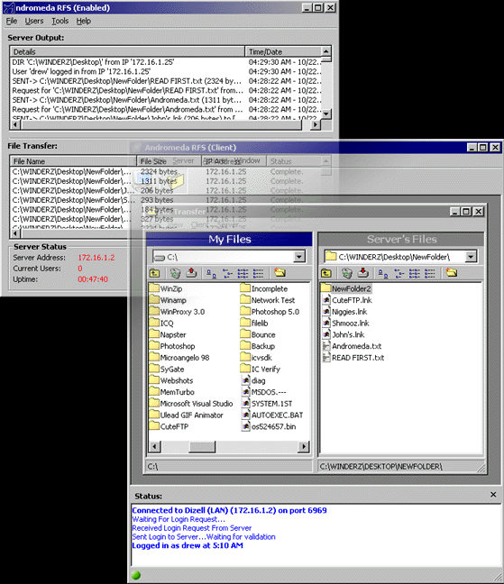



## Andromeda\!

### Description

Andromeda Remote File System is a complete Client/Server architecture application that includes both the server and client projects. Andromeda uses Winsock to communicate over a TCP/IP connection. The server supports multiple users, and encrypted passwords.

Features:

Download/Upload file(s) and folder(s)

Move file(s) and folder(s)

Rename file(s) and folder(s)

Delete file(s) and folder(s)

Create new folder

Spawn/Terminate executables

and much more...

The client uses a custom class to download and upload multiple files to the server. You may also add more than one Andromeda server to connect to. Supports drag-and-drop between client and server. Server keeps complete logs of login events, file transfers, and will even log server output, if specified in options. This program is similar to CuteFTP, but does not use the File Transfer Protocol. Instead, we implemented our own 'Protocol' for the client and server to communicate. Server can accept multiple connections simultaneously. Demonstrates usage of the Microsoft Winsock ActiveX control, using synchronized data transfer, using arrays of Winsock controls for a multiple connection server, using Collections, opening files for both binary and text reading/writing, etc... YOU MUST SEE THIS! PLEASE VOTE FOR THIS CODE IF YOU LIKE IT!!

*Bugs Fixed! October 24th*
 
### More Info
 
Andromeda Remote File System is a complete Client/Server architecture application that includes both the server and client projects. Andromeda uses Winsock to communicate over a TCP/IP connection. The server supports multiple users, and encrypted passwords.

Features:

Download/Upload file(s) and folder(s)

Move file(s) and folder(s)

Rename file(s) and folder(s)

Delete file(s) and folder(s)

Create new folder

Spawn/Terminate executables

and much more...

The client uses a custom class to download and upload multiple files to the server. You may also add more than one Andromeda server to connect to. Supports drag-and-drop between client and server. Server keeps complete logs of login events, file transfers, and will even log server output, if specified in options. This program is similar to CuteFTP, but does not use the File Transfer Protocol. Instead, we implemented our own 'Protocol' for the client and server to communicate. Server can accept multiple connections simultaneously. Demonstrates usage of the Microsoft Winsock ActiveX control, using synchronized data transfer, using arrays of Winsock controls for a multiple connection server, using Collections, opening files for both binary and text reading/writing, etc... YOU MUST SEE THIS! PLEASE VOTE FOR THIS CODE IF YOU LIKE IT!!

             |
---                |---
**Submitted On**   |2000-10-23 15:58:36
**By**             |[One Light, Inc\.](https://github.com/Planet-Source-Code/PSCIndex/blob/master/ByAuthor/one-light-inc.md)
**Level**          |Advanced
**User Rating**    |4.8 (302 globes from 63 users)
**Compatibility**  |VB 6\.0
**Category**       |[Complete Applications](https://github.com/Planet-Source-Code/PSCIndex/blob/master/ByCategory/complete-applications__1-27.md)
**World**          |[Visual Basic](https://github.com/Planet-Source-Code/PSCIndex/blob/master/ByWorld/visual-basic.md)
**Archive File**   |[CODE\_UPLOAD1100010272000\.zip](https://github.com/Planet-Source-Code/one-light-inc-andromeda__1-12224/archive/master.zip)

